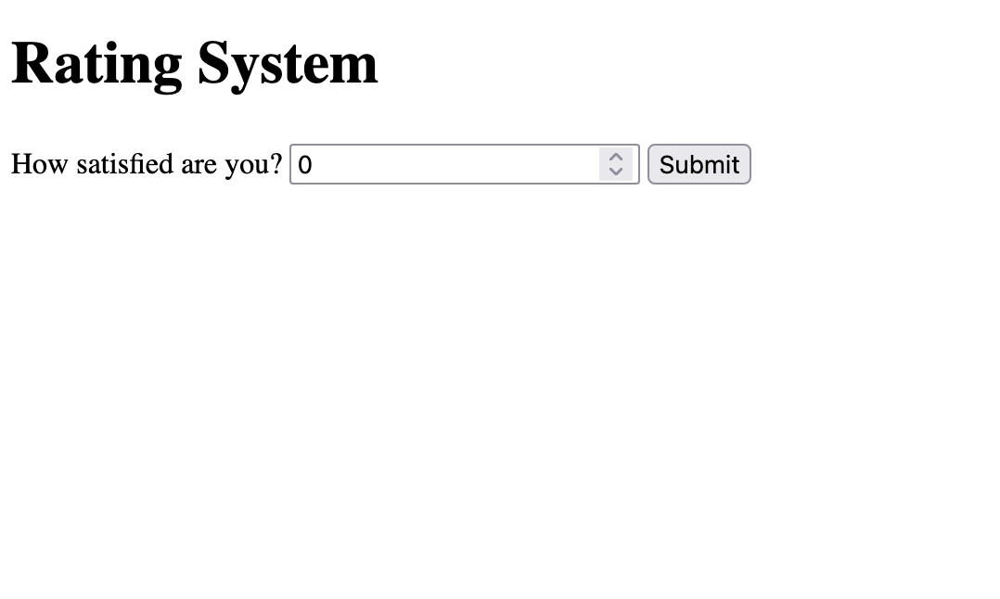
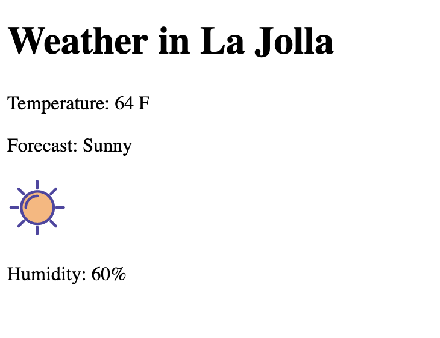
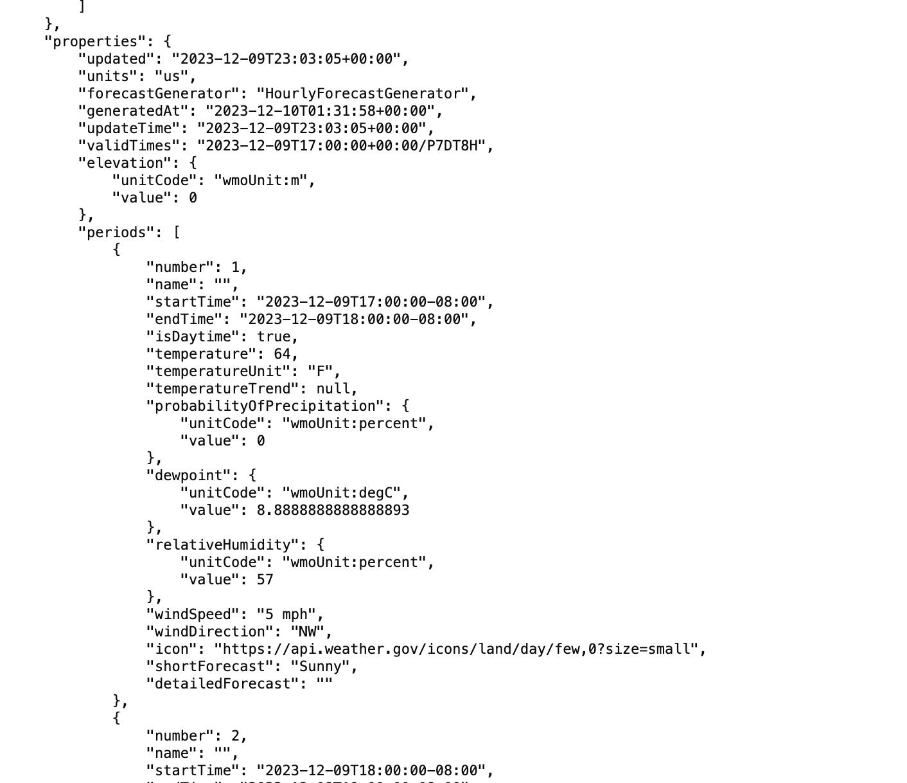

# Homework 5
## No js rating system

## js rating system

## Weather component

## endpoint data

## endpoint & icons explanation
I use the national weather service api, which gave me a json object that contained all the weather data I needed

I used freely licensed svg icons from [https://www.svgrepo.com/vectors], I made the icon used change based on whether the weather description contains different keywords

